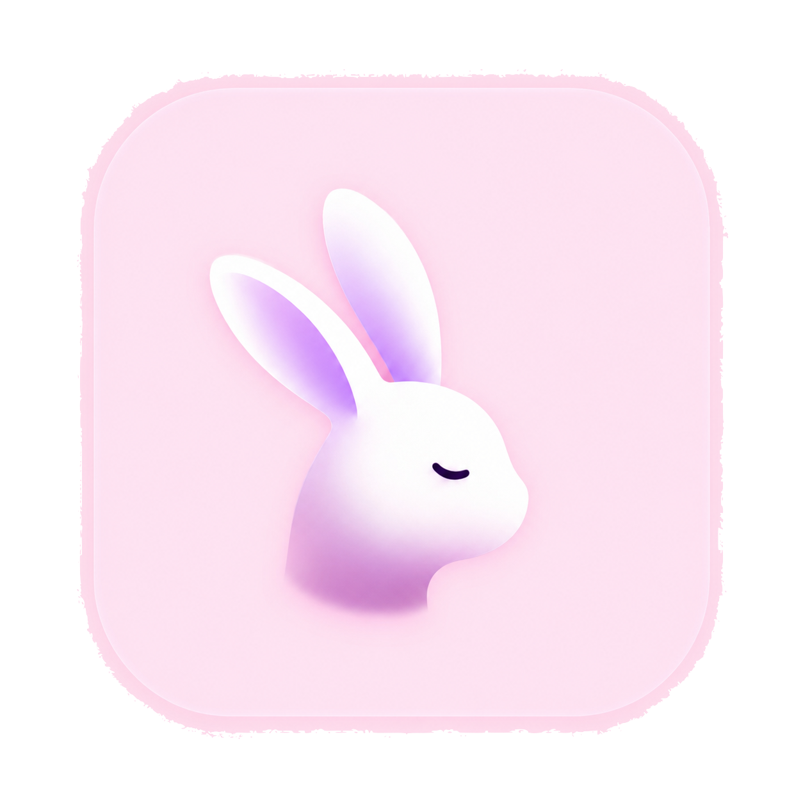
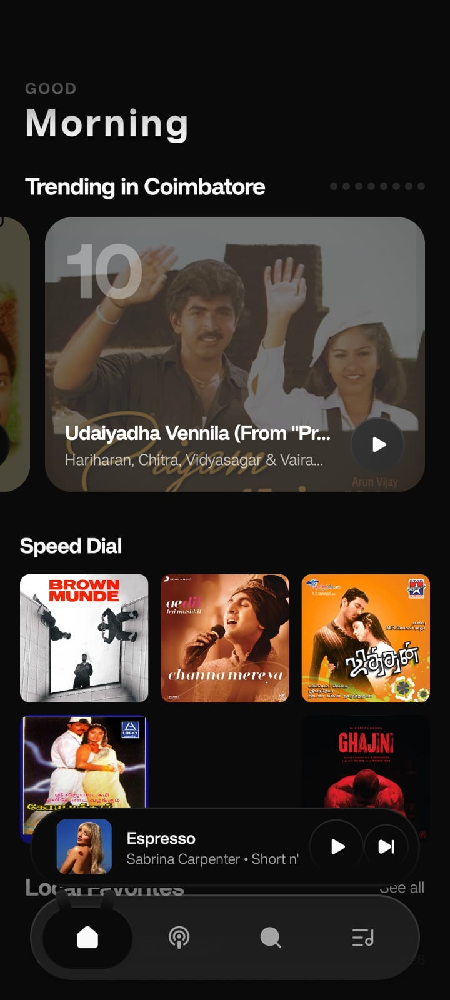
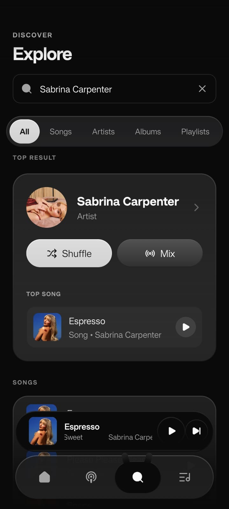
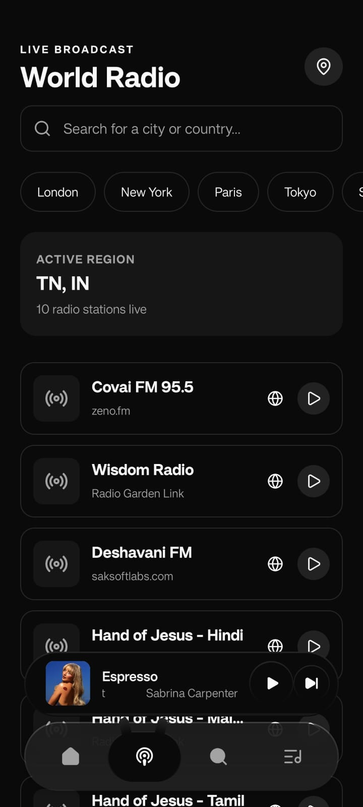
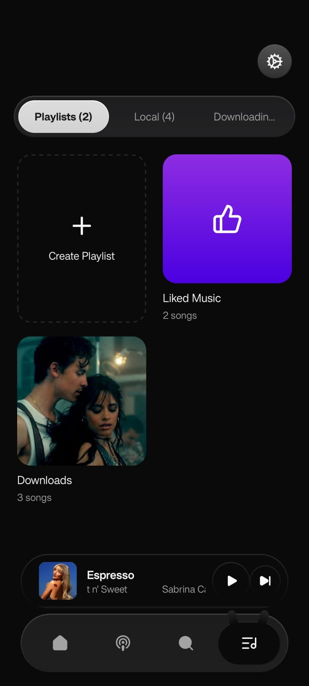

<p align="center">
  
</p>

<h1 align="center">Bunny Music</h1>

<p align="center">
  <b>A state-of-the-art, high-fidelity audio streaming client for Android.</b><br/>
  Synthesized using React Native, Expo Router, and native Kotlin extraction engines.
</p>

<p align="center">
  <a href="https://reactnative.dev/"></a>
  <a href="https://expo.dev/"></a>
  <a href="https://kotlinlang.org/"></a>
  
</p>

<p align="center">
  
  
  
  
</p>

---

## Table of Contents
*   [Unique Selling Points](#unique-selling-points)
*   [User Interface Showcase](#user-interface-showcase)
*   [Deep Technical Specs](#deep-technical-specs)
*   [Installation & Quick Start](#installation--quick-start)
*   [Troubleshooting & FAQ](#troubleshooting--faq)
*   [Privacy, Compliance & Disclaimer](#privacy-compliance--disclaimer)
*   [Community & Licensing](#community--licensing)
*   [Credits & Inspiration](#credits--inspiration)

---

## Unique Selling Points

*   **Hybrid Engine Architecture**: On Android, metadata queries bypass web browser restrictions and heavy proxies via custom native Kotlin modules. Non-Android builds seamlessly fall back to public client-side Javascript Piped API handlers.
*   **"Open With" Local Audio Files**: Open local audio files directly in the app with native ID3 parsing, cover art fetching, and embedded USLT lyrics extraction.
*   **Custom Audio Ringtone Trimmer**: Directly slice any downloaded song to set as your phone's default ringtone via a customizable 30-second range slider.
*   **Brand Logo Splash Transition**: Beautiful, video-like splash-to-layout logo morph animation on the About settings page with concentric soundwave ripples.
*   **Music-Style Background Glow**: Subtle ambient gradient glowing backdrop that blends cleanly with light/dark theme schemes.
*   **Radio Garden Explorer**: Discover, query, and stream thousands of live radio stations from around the globe using local geo-location APIs or manual presets.
*   **Ultra-Smooth Sync Lyrics**: Displays synchronized active lyrics with fluid 60/120 FPS micro-scroll animations driven directly by the native UI-thread.
*   **Ultimate Personalization Suite**: Full theme configurations (dynamic dark/light modes, user-selectable accent palettes, custom fonts) and audio playback behaviors (cache management, update notifications).

---

## User Interface Showcase
<p align="center">
  <table>
    <tr>
      <td align="center"><b>Home</b></td>
      <td align="center"><b>Explore &amp; Charts</b></td>
    </tr>
    <tr>
      <td align="center"></td>
      <td align="center"></td>
    </tr>
    <tr>
      <td align="center"><b>Live Radio</b></td>
      <td align="center"><b>Library &amp; Offline</b></td>
    </tr>
    <tr>
      <td align="center"></td>
      <td align="center"></td>
    </tr>
  </table>
</p>

---

## Deep Technical Specs

### 1. Dual-Path Stream Processing
*   **Android Native Client**: Custom Gradle scripts compile [`modules/innertube`](/modules/innertube) and [`modules/youtube-extractor`](/modules/youtube-extractor) into highly-optimized Kotlin packages. They interact directly with YouTube Music client components via OkHttp and NewPipe bindings.
*   **Web/iOS Failover**: Uses client-side AJAX calls to standard public Piped API gateways, providing universal cross-platform portability.

### 2. Micro-Animated Lyrics Sync
Bunny queries [LrcLib](https://github.com/valeriangalliat/lrclib) to match active songs by name, artist, and duration.
*   The lyrics scroller computes vertical line offsets in real-time.
*   Scroll transitions are fed directly to **React Native Reanimated** UI-thread clocks, ensuring micro-animations never stutter, even during heavy UI interaction.

### 3. Build-Time Gradle Injection
The Expo plugin [`withAppConfiguration.js`](/plugins/withAppConfiguration.js) customizes compilation parameters:
*   Enforces Kotlin Compiler JVM Target version to `17`.
*   Enables Minification and Resource Shrinking in release profiles.
*   Protects reflection classes from obfuscation via dynamic `proguard-rules.pro` insertion.
*   Automates `intent-filter` inclusion in the Android Manifest to bind file extensions and audio MIME types natively.

---

## Installation & Quick Start

Ensure you have [Node.js](https://nodejs.org/), [JDK 17](https://openjdk.org/projects/jdk/17/), and [Android SDK](https://developer.android.com/studio) installed.

### 1. Clone & Install
```bash
git clone https://github.com/Kowsik-Y/Bunny.git
cd Bunny
npm install
```

### 2. Prebuild Native Directories
Expo config plugins will run automatically to generate the native Android code:
```bash
npx expo prebuild --platform android --clean
```

### 3. Launch Development Server
```bash
npm run android
```

### 4. Build Production Split APKs
To generate architecture-optimized binaries:
```bash
cd android
./gradlew assembleRelease
```
*Outputs will be created under `android/app/build/outputs/apk/release/`.*

---

## Troubleshooting & FAQ

#### Q1: Gradle build fails with JVM / JDK mismatch error?
Make sure your system's `JAVA_HOME` variable is pointing to **JDK 17**. You can check this by running `java -version` in your terminal.

#### Q2: TrackPlayer setup fails or throws an exception on iOS/Web?
Bunny uses platform detection to gracefully handle systems where `react-native-track-player` doesn't fully support native background bindings. Ensure you run on an emulator or real Android device to test native audio services.

#### Q3: How do I clear the cached files to free up space?
Go to **Settings** -> **Cache Manager** -> **Clear App Cache** to safely wipe local caching tables and indexing databases.

---

## Privacy, Compliance & Disclaimer

Bunny is developed strictly as a client-side interface and adheres to standard privacy and media compliance guidelines:
*   **Zero-Server Logging**: Search queries and playback metadata are never routed to intermediate servers. All requests go directly to source APIs from your device.
*   **No Content Storage**: All stream indexes are resolved on-the-fly from public domain links.
*   **Local Sandboxing**: Caches and downloads remain completely isolated inside the Android sandbox context.
*   **Disclaimer**: This project is not affiliated with, authorized, or endorsed by Google LLC, YouTube, or Radio Garden. For full legal terms, please read the [Disclaimer](/DISCLAIMER.md) file.

---

## Community & Licensing

*   **Code of Conduct**: Review our community behavior rules in [CODE_OF_CONDUCT.md](/CODE_OF_CONDUCT.md).
*   **Contributing**: Learn how to contribute features and set up local development in [CONTRIBUTING.md](/CONTRIBUTING.md).
*   **License**: This project is licensed under the GPL-3.0 General Public License. Read [LICENSE](/LICENSE) for details.
*   **Security Policy**: Report vulnerabilities responsibly by following our policy in [SECURITY.md](/SECURITY.md).

---

## Credits & Inspiration

*   **App Inspiration**: Inspired by the designs and concepts of [Echo Music](https://github.com/Kowsik-Y/Bunny) and [ViMusic](https://github.com/vfsfitvnm/ViMusic).
*   **Extraction Libraries**: [NewPipeExtractor](https://github.com/TeamNewPipe/NewPipeExtractor) & [InnerTube Client](https://github.com/TeamNewPipe/InnerTube).
*   **Streaming Gateways**: [Piped](https://github.com/TeamPiped/Piped) & [Radio Garden](https://radio.garden).
*   **Media Stack**: [react-native-track-player](https://github.com/doublesymmetry/react-native-track-player) & [LrcLib API](https://lrclib.net/).
*   **Graphics & Vectors**: [SVG Repo](https://www.svgrepo.com/).
